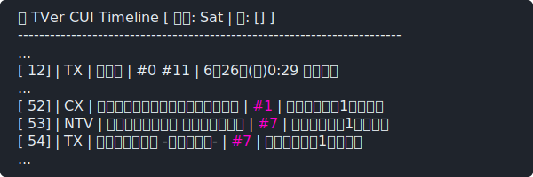
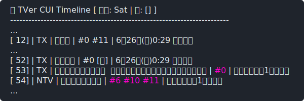
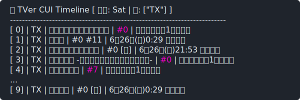
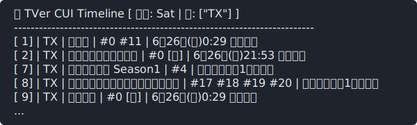
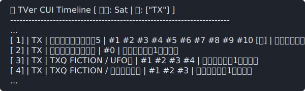

# Tveru


## 概要
TVerの番組一覧（ドラマ）をコンソールで閲覧するためのCLIユーティリティプログラムです。

## 環境
- cargo 1.97.1 on Fedora 44 (7.1.4-200)
- chromedriver 150.0.7871.124
- mpv 0.41.0
- yt-dlp 2026.07.04

## 特徴
- キーボードインタフェース
- 1番組1行に全エピソードを集約する高密度レイアウト

## 構築とインストール

```bash
$ cargo install --git https://github.com/mkatase/tveru.git
```

## 実行モード
| オプション    | 説明                                                     | 備考 |
|:--------------|:---------------------------------------------------------|:-----|
| -d, --day     | 曜日を指定してフィルタリングする                         | *1   |
| -n, --network | 指定した系列局コードでフィルタリングする                 | *2   |
| -a, --archive | 過去作アーカイブを含めて表示する                         | *3   |
| -f, --full    | フルクローリング巡回を実行する                           |      |
| -s, --strict  | 本編のみを非表示（予告や直前SP等を非表示）               | *4   |
| -p, --player  | 使用するプレイヤー/スクリプトを指定する                  |      |
| -r, --refresh | キャッシュを破棄して、最新データを最新データを再取得する |      |
- *1: 指定可能な文字列は、Sun、Mon、Tue、Wed、Thu、Fri、Sat。
- *2: 指定可能な文字列は、NTV、TBS、CX、EX、TX、NHK、OTHER。
- *3: 通常の一覧に加えて、配信中の過去作品アーカイブも表示に含めます。
- *4: 本編以外の「直前SP」「予告」「ナビ」等のクリップを非表示にします。


## TVERU_PLAYER変数
- tveruのデフォルトの動画プレイヤーはmpvですが、ストリーミング対応が
可能なプレイヤー（またはラッパースクリプト）であれば、環境変数、もしくは、
-pオプションを使用することで、簡単に切り替えが可能です。
```bash
 $ mpv https://example.com/xxxx
 $ tveru -n EX 0 3
 $ tveru -n EX -p mpv 0 3
 $ TVERU_PLAYER=mpv tveru -n EX 0 3
```
## 使用方法

1. [エントリを取得する](#usage1)
2. [エントリを再取得する](#usage2)
3. [対象局を指定する](#usage3)
4. [本編のみを表示する](#usage4)
5. [アーカイブを表示する](#usage5)
6. [対象日を指定する](#usage6)
7. [対象動画を見る](#usage7)
### <a id="usage1"></a>エントリを取得する
```bash
 $ tveru
```

### <a id="usage2"></a>エントリを再取得する
```bash
 $ tveru --refresh
 or
 $ tveru -r
```

### <a id="usage3"></a>対象局を指定する
```bash
 $ tveru -n TX
 or 
 $ tveru --network TX
```

- 対象局は、カンマ区切りを用いて、複数指定が可能です。
- 複数指定は、他オプションとも併用可能です。
```bash
 $ tveru -n TX,EX
 or
 $ tveru --network TX,EX
```
### <a id="usage4"></a></a>本編のみを表示する
```bash
 $ tveru -n TX -s
 or
 $ tveru --network TX --strict
```

### <a id="usage5"></a></a>アーカイブを表示する
```bash
 $ tveru -n TX -a
 or
 $ tveru --network TX --archive
```

### <a id="usage6"></a></a>対象日を指定する
```bash
 $ tveru -n TX -d Fri
 or
 $ tveru --network TX --day Fri
```
### <a id="usage7"></a></a>対象動画を見る
- 「惡の華」の「＃０（最終回）」を見るには、Index（左端）とEpisode（＃項番）を指定します。
```bash
 $ tveru -n TX 1 0
 or
 $ tveru --network TX 1 0
```
- 備考: -p オプションにプレイヤーの代わりに自作のダウンロード用シェルスクリプトを指定することで、動画をローカルに自動保存（サルベージ）することも可能です。
## 既知の問題
- エピソード番号が０だったり、連番になっていない現象：
 - TVerの生データは、話数とエピソード題名（サブタイトル）が同一文字列内に混在しているため、厳密な切り分けが極めて困難です。そのため、タイトル文字列の中に含まれる野生の数字（固有名詞「五郎(5)」や煽り文句など）を話数として誤認識する場合があります。
- なお、エピソード番号 0 は最終回フラグ [終] として内部的にマッピングされます。
## tveru_cache.json
- Fetch実行後、XDG_RUNTIME_DIR 内に tveru_cache.json という名前で生データをキャッシュします。このJSONファイルを用いて他のシェルスクリプトやパイプラインと連携させることも可能です。
## 備考
- 本ファイルは、mdivideにて生成。元ファイルは、[こちら](./docs/README.txt)。
## ChangeLog
- ChageLog is [Here](./CHANGELOG.md)
## License
- License is [MIT](./LICENSE)
## 🎧 B.G.M.
- [Borderline(1983)/マドンナ](https://www.youtube.com/watch?v=rSaC-YbSDpo)
